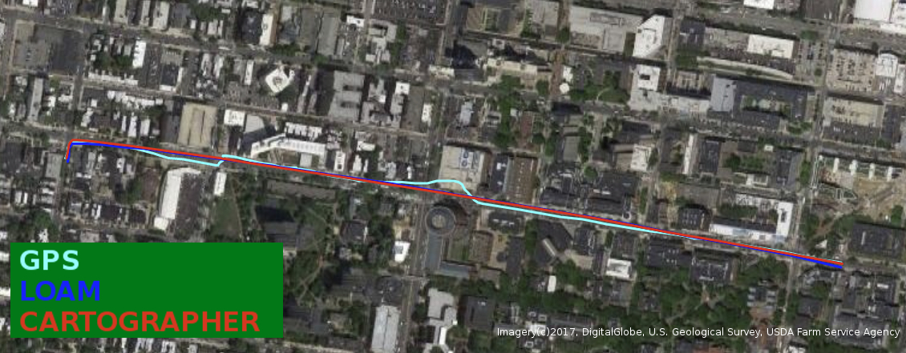
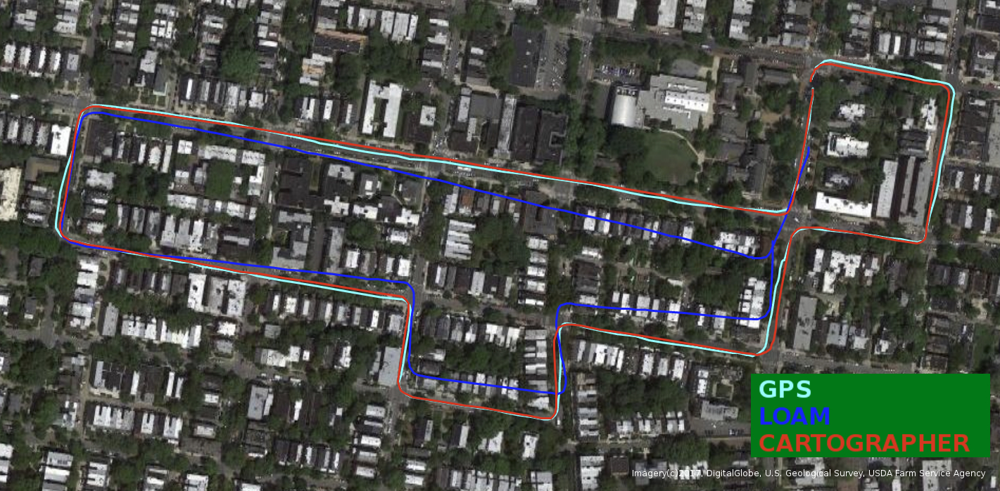
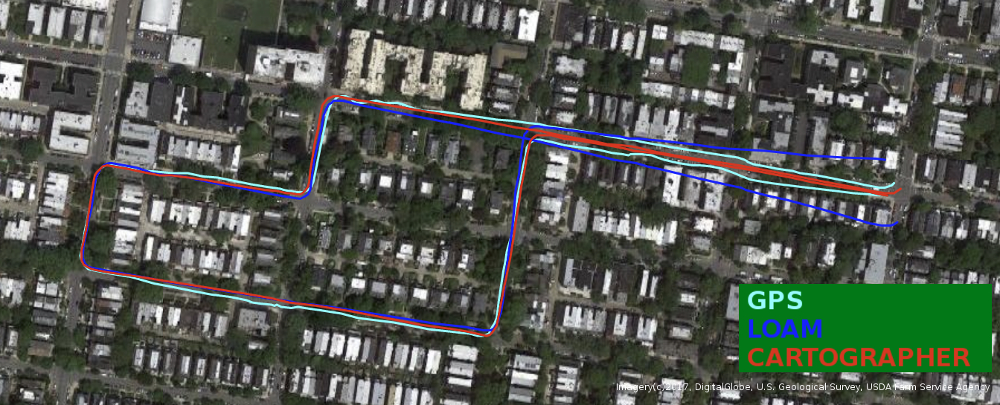

## HDF5 Files
The data streams from the individual sensors have been combined into hdf5 files that mirror the ROS bag structure. hdf5 is a standard format with support in almost any language, and should enable easier development for non-ROS users.

The timestamps for each topic are embedded as an additional array with suffix '_ts'. For example in python, loading a file and reading the left grayscale images and timestamps would involve the following lines of code:

```python
import h5py
data = h5py.File('outdoor_day2_data.hdf5')
images = data['davis']['left']['image_raw']
image_ts = data['davis']['left']['image_raw_ts']
```

In addition, we provide a mapping for the nearest event to each DAVIS image in time, as, for example,
```python
image_raw_event_inds = data['davis']['left']['image_raw_event_inds']
```
, where ```image_raw_event_inds[image_ind]``` would be the event index corresponding to image ```image_ind```.

Note that the events are concatenated into a single array, and as such do not have the associated ROS message timestamps. However, each individual event retains its timestamp.

The files can be found in the Google Drive folder here: https://drive.google.com/open?id=1rwyRk26wtWeRgrAx_fgPc-ubUzTFThkV

## ROS Bags

To process the bag files, you will need the <a href="https://github.com/uzh-rpg/rpg_dvs_ros">rpg_dvs_ros</a> package to read the events (in particular dvs_msgs). You may also optionally install the <a href="https://github.com/ethz-asl/visensor_node">visensor_node</a> to have access to the /cust_imu0 topic, which includes the magnetometer, pressure and temperature outputs of the VI-Sensor.

Sequences will be added to this page on a rolling basis. We also plan to include videos for each sequence.

Note that these bags are large (up to 27G).

If the server is down (links no longer work), the individual files can be found [here](https://drive.google.com/drive/folders/1gDy2PwVOu_FPOsEZjojdWEB2ZHmpio8D?usp=sharing).

<div style='float:left;margin-left:5%'>
<table>
<col width="30%">
<col width="10%">
<col width="50%">
<tr><td>Scene</td><td>Calibration</td><td>Sequence</td><td>Map/Image</td></tr>
<tr>
<td>Indoor flying (Note: No VI-Sensor data is available for this scene).</td>
<td>
<a href="http://visiondata.cis.upenn.edu/mvsec/indoor_flying/indoor_flying_calib.zip">Calibration</a>
</td>
<td>
Indoor Flying 1 <a href="http://visiondata.cis.upenn.edu/mvsec/indoor_flying/indoor_flying1_data.bag">Data (1.2G)</a> <a href="http://visiondata.cis.upenn.edu/mvsec/indoor_flying/indoor_flying1_gt.bag">Ground truth (2.6G)</a>
</td>
</tr>
<tr>
<td>
</td>
<td>
</td>
<td>
Indoor Flying 2 <a href="http://visiondata.cis.upenn.edu/mvsec/indoor_flying/indoor_flying2_data.bag">Data (1.7G)</a> <a href="http://visiondata.cis.upenn.edu/mvsec/indoor_flying/indoor_flying2_gt.bag">Ground truth (3.2G)</a>
</td>
</tr>
<tr>
<td>
</td>
<td>
</td>
<td>
Indoor Flying 3 <a href="http://visiondata.cis.upenn.edu/mvsec/indoor_flying/indoor_flying3_data.bag">Data (1.8G)</a> <a href="http://visiondata.cis.upenn.edu/mvsec/indoor_flying/indoor_flying3_gt.bag">Ground truth (3.5G)</a>
</td>
</tr>
<tr>
<td>
</td>
<td>
</td>
<td>
Indoor Flying 4 <a href="http://visiondata.cis.upenn.edu/mvsec/indoor_flying/indoor_flying4_data.bag">Data (419M)</a> <a href="http://visiondata.cis.upenn.edu/mvsec/indoor_flying/indoor_flying4_gt.bag">Ground truth (738M)</a>
</td>
</tr>
<tr>
<td>Outdoor Driving Day (Note: A hardware failure caused the grayscale images on the right DAVIS grayscale images for this scene to be corrupted. However, VI-Sensor grayscale images are available).</td>
<td>
<a href="http://visiondata.cis.upenn.edu/mvsec/outdoor_day/outdoor_day_calib.zip">Calibration</a>
</td>
<td>
Outdoor Day 1 <a href="http://visiondata.cis.upenn.edu/mvsec/outdoor_day/outdoor_day1_data.bag">Data (9.7G)</a> <a href="http://visiondata.cis.upenn.edu/mvsec/outdoor_day/outdoor_day1_gt.bag">Ground truth (9.5G)</a>
</td>
<td>
<a target="_blank" href="../figs/gt_maps/west_philly_day1_traj.jpg">

</a>
</td>

</tr>
<tr>
<td>
</td>
<td>
</td>
<td>
Outdoor Day 2 <a href="http://visiondata.cis.upenn.edu/mvsec/outdoor_day/outdoor_day2_data.bag">Data (27G)</a> <a href="http://visiondata.cis.upenn.edu/mvsec/outdoor_day/outdoor_day2_gt.bag">Ground truth (23G)</a>
</td>
<td>
<a target="_blank" href="../figs/gt_maps/west_philly_day2_traj.jpg">

</a>
</td>
</tr>
<tr>
<td>Outdoor Driving Night</td>
<td>
<a href="http://visiondata.cis.upenn.edu/mvsec/outdoor_night/outdoor_night_calib.zip">Calibration</a>
</td>
<td>
Outdoor Night 1 <a href="http://visiondata.cis.upenn.edu/mvsec/outdoor_night/outdoor_night1_data.bag">Data (8.1G)</a> <a href="http://visiondata.cis.upenn.edu/mvsec/outdoor_night/outdoor_night1_gt.bag">Ground truth (9.5G)</a>
</td>
<td>
<a target="_blank" href="../figs/gt_maps/west_philly_night1_traj.jpg">

</a>
</td>
</tr>
<tr>
<td>
</td>
<td>
</td>
<td>
Outdoor Night 2 <a href="http://visiondata.cis.upenn.edu/mvsec/outdoor_night/outdoor_night2_data.bag">Data (11G)</a> <a href="http://visiondata.cis.upenn.edu/mvsec/outdoor_night/outdoor_night2_gt.bag">Ground truth (11G)</a>
</td>
<td>
<a target="_blank" href="../figs/gt_maps/west_philly_night2_traj.jpg">

</a>
</td>
</tr>
<tr>
<td>
</td>
<td>
</td>
<td>
Outdoor Night 3 <a href="http://visiondata.cis.upenn.edu/mvsec/outdoor_night/outdoor_night3_data.bag">Data (9G)</a> <a href="http://visiondata.cis.upenn.edu/mvsec/outdoor_night/outdoor_night3_gt.bag">Ground truth (11G)</a>
</td>
<td>
<a target="_blank" href="../figs/gt_maps/west_philly_night3_traj.jpg">

</a>
</td>
</tr>
<tr>
<td>Motorcycle (Note: No lidar).</td>
<td>
<a href="http://visiondata.cis.upenn.edu/mvsec/motorcycle/motorcycle_calib.zip">Calibration</a>
</td>
<td>
Highway 1 <a href="http://visiondata.cis.upenn.edu/mvsec/motorcycle/motorcycle_data.bag">Data (42G)</a> <a href="http://visiondata.cis.upenn.edu/mvsec/motorcycle/motorcycle_gt.bag">Ground truth (659K)</a>
</td>
</tr>
</table>
</div>

<BR CLEAR="all">

## Ground Truth Optical Flow Generation
In addition to the ground truth provided by the original dataset, we provide code to generate dense ground truth optical flow for each sequence with ground truth poses and depths. For storage and bandwidth reasons, we do not provide the optical flow directly, but instead provide the code to generate it from the ground truth provided here. The method for this is outlined in the paper:
<br>[EV-FlowNet: Self-Supervised Optical Flow Estimation for Event-based Cameras](http://www.roboticsproceedings.org/rss14/p62.pdf).

The processed optical flow ground truth has been saved in numpy format (.npz), and can be found [here](https://drive.google.com/drive/u/2/folders/1XS0AQTuCwUaWOmtjyJWRHkbXjj_igJLp). The ground truth flow for each sequence has a suffix of ```_gt_flow_dist```. Each npz file contains a dictionary with keys: ```'timestamps'```, ```'x_flow_dist'```, ```'y_flow_dist'```.

We also provide files with suffix ```_odom```, which contains a dictionary with keys: ```'timestamps'```, ```'lin_vel'```, ```'ang_vel'```, ```'pos'```, ```'quat'```.

The git repo for this ground truth can be found here:
[https://github.com/daniilidis-group/mvsec/tree/master/tools/gt_flow](https://github.com/daniilidis-group/mvsec/tree/master/tools/gt_flow).

If you use this optical flow dataset, please cite:

Zhu, A. Z., Yuan, L., Chaney, K., Daniilidis, K. (2018). [EV-FlowNet: Self-Supervised Optical Flow Estimation for Event-based Cameras](http://www.roboticsproceedings.org/rss14/p62.pdf) Robotics: Science and Systems 2018.
