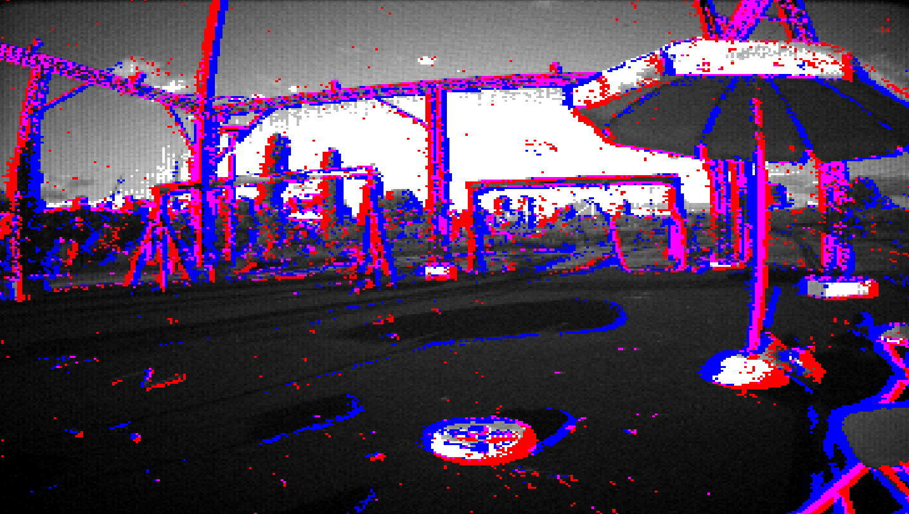
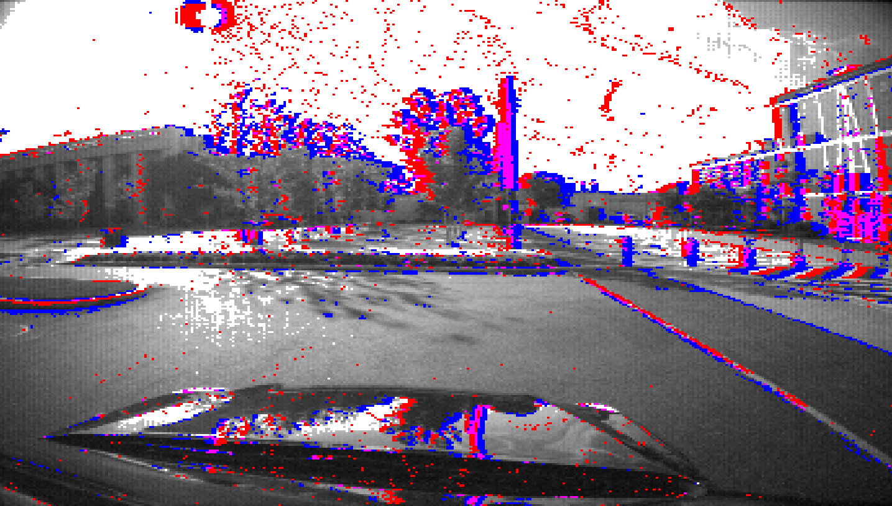
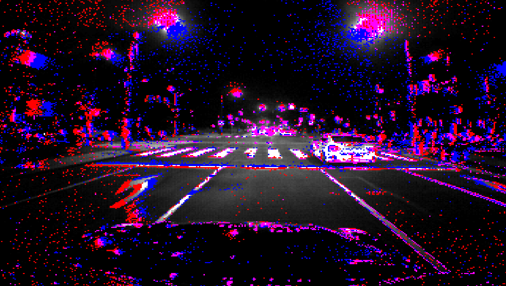
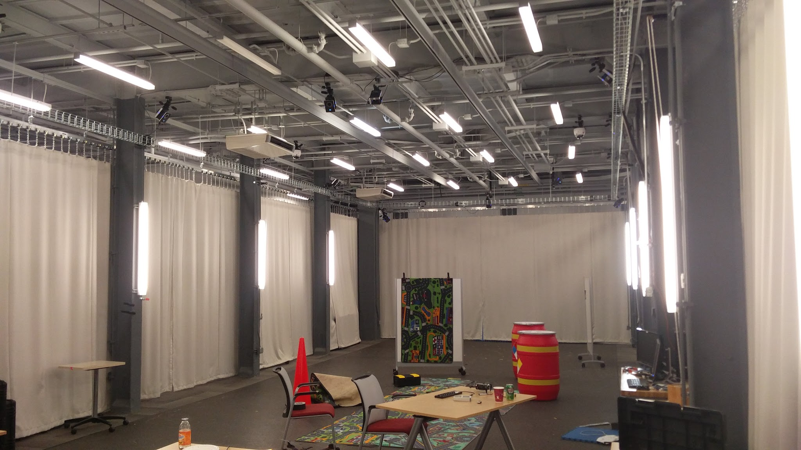
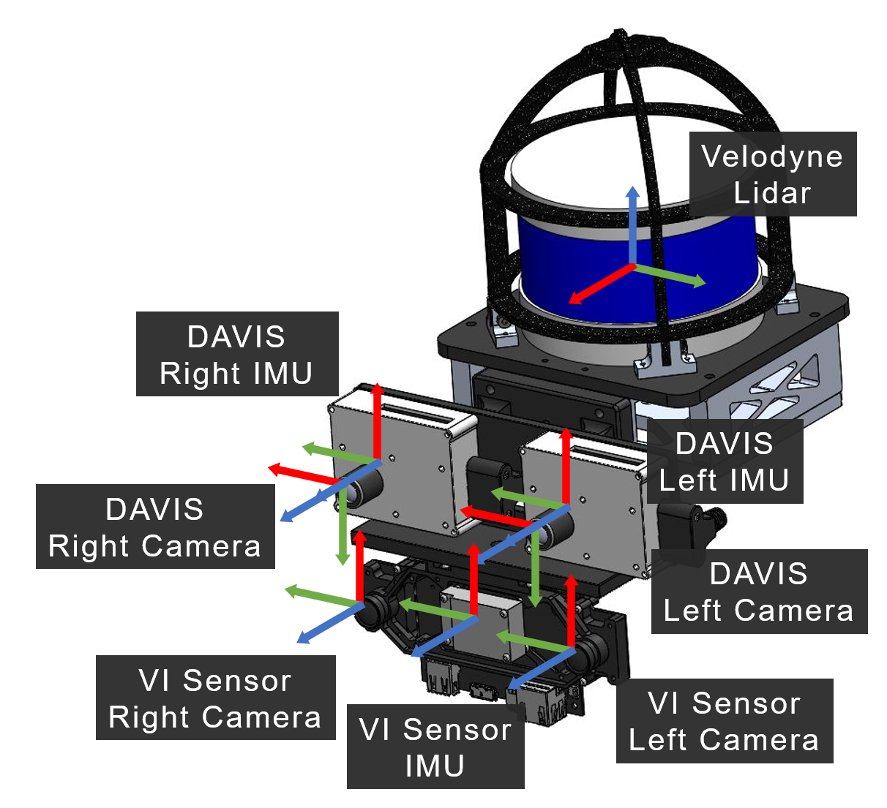

April 18 2019: We have generated HDF5 files as a ROS free alternative for the dataset. These are now available for download, please see the Downloads section.

Ground truth optical flow is now available, as presented in "EV-FlowNet: Self-Supervised Optical Flow Estimation for Event-based Cameras". See the Downloads page for more info.

## The Multi Vehicle Stereo Event Camera Dataset

The Multi Vehicle Stereo Event Camera dataset is a collection of data designed for the development of novel 3D perception algorithms for **event based cameras**. Stereo event data is collected from car, motorbike, hexacopter and handheld data, and fused with lidar, IMU, motion capture and GPS to provide ground truth pose and depth images. In addition, we provide images from a standard stereo frame based camera pair for comparison with traditional techniques.

Event based cameras are a new **asynchronous** sensing modality that measure changes in image intensity. When the log intensity over a pixel changes above a set threshold, the camera **immediately** returns the pixel location of a change, along with a timestamp with **microsecond** accuracy, and the direction of the change (up or down). This allows for sensing with extremely low latency. In addition, the cameras have extremely **high dynamic range** and **low power usage**.

<iframe width="560" height="315" src="https://www.youtube.com/embed/9FaUvvzaHW8" frameborder="0" allow="autoplay; encrypted-media" allowfullscreen></iframe>

## Sequences

<table class="image">
<tr><td>

</td>

<td>

</td>

<td>

</td>
</tr>
<tr>
<td class="caption">

Hexacopter Indoor

</td>
<td class="caption">

Hexacopter Outdoor

</td>
<td class="caption">

Handheld

</td>
<tr>
<td>

</td>
<td>

</td>
</tr>
<tr>
<td class="caption">

Daytime Driving

</td>
<td class="caption">

Nighttime Driving

</td>
</tr>
</table>

Data was collected from four different vehicles, in both indoor and outdoor environments, in day and night settings. All hexacopter sequences have motion capture ground truth from an indoor Vicon area and outdoor Qualisys area, while the other sequences have ground truth generated by fusing lidar information with IMU and GPS.
The full list of sequences can be found below: 

<table>
<tr><td>Vehicle</td><td>Sequence</td></tr>
<tr>
<td>Hexacopter</td>
<td>
<ul>
<li>Indoor short</li>
<li>Indoor long</li>
<li>Outdoor afternoon</li>
<li>Outdoor evening</li>
</ul>
</td>
</tr>
<tr>
<td>Handheld</td>
<td>
<ul>
<li>Indoor-outdoor</li>
<li>Outdoor-indoor</li>
</ul>
</td>
</tr>
<tr>
<td>Outdoor Car</td>
<td>
<ul>
<li>Pennovations day</li>
<li>Pennovations evening</li>
<li>West Philadelphia day</li>
<li>West Philadelphia evening</li>
</ul>
</td>
</tr>
<tr>
<td>Motorcycle</td>
<td>
<ul>
<li>Motorcycle highway</li>
</ul>
</td>
</tr>
</table>

Indoor Vicon motion capture area.

Outdoor Qualisys motion capture area.

 

<h2>Sensors</h2>

A number of different sensors and modalities and rigidly mounted to a stereo event camera pair, in order to generate accurate ground truth information, as well as to provide avenues for research in sensor fusion between modalities.
 
 
For events, two experimental DAVIS 346B cameras are mounted in a stereo (X axes aligned) configuration. each camera has a resolution of 346x260 pixels, with a 4mm lens and roughly 70 degrees vertical field of view. The camera clocks are synchronized by a hardware trigger generated by the left camera and send to the right camera. In addition to events, the cameras also each generate IMU and frame based image measurements.
 
 
In addition, a Velodyne lidar and stereo frame based camera with IMU (VI Sensor) is mounted with the DAVIS cameras. When available, ground truth pose is also captured using an indoor (Vicon, left) or outdoor (Qualisys, right) motion capture system.
 
 
The full set of sensor characteristics can be found below:

<table>
<tr><td>Sensor</td><td>Characteristics</td></tr>
<tr>
<td>DAVIS 346B</td>
<td>
<ul>
<li>346x260 pixels</li>
<li>APS (Active Pixel Sensor for frame based images)</li>
<li>DVS (Dynamic Vision Sensor for events)</li>
<li>FOV: 50&deg vert., 65&deg horiz.</li>
<li>IMU: MPU 6150 at 1kHz</li>
</ul>
</td>
</tr>
<tr>
<td>VI-Sensor</td>
<td>
<ul>
<li>Skybotix integrated VI-sensor</li>
<li>stereo camera: 2 x Aptina MT9V034</li>
<li>gray 2x752x480 at 20fps, global shutter</li>
<li>FOV: 57deg vert., 2 x 80deg horiz.</li>
<li>IMU: ADIS16488 at 200Hz</li>
</ul>
</td>
</tr>
<tr>
<td>Velodyne Puck LITE</td>
<td>
<ul>
<li>VLP-16 PUCK LITE</li>
<li>FOV: 30&deg vert. 360&deg horiz.</li>
<li>16 channel</li>
<li>20Hz</li>
<li>100m range</li>
</ul>
</td>
</tr>
<tr>
<td>GPS</td>
<td>
<ul>
<li>UBLOX NEO-M8N</li>
<li>72-channel u-blox M8 engine</li>
<li>Position accuracy 2.0m CEP</li>
</ul>
</td>
</tr>
<td>Motion Capture</td>
<td>
<ul>
<li>Indoor Vicon</li>
<li>88 x 22 x 15 ft</li>
<li>20 Vicon Vantage VP-16 Cameras</li>
<li>100Hz pose updates</li>
<li>Outdoor Qualisys</li>
<li>100 x 50 x 50 ft</li>
<li>34 Qualisys Opus 700 Cameras</li>
<li>100Hz pose updates</li>
</ul>
</td>
</tr>
</table>

## Ground Truth

For most sequences, accurate pose and depths are provided from a fusion of the sensors onboard.

Reconstructed map with trajectory in green.

Depth map (red) overlaid on APS from DAVIS, lighter is further.

## Citations

Please cite the following papers when using this work in an academic publication:

For the main dataset, please cite:

Zhu, A. Z., Thakur, D., Ozaslan, T., Pfrommer, B., Kumar, V., & Daniilidis, K. (2018). [The Multi Vehicle Stereo Event Camera Dataset: An Event Camera Dataset for 3D Perception.](http://doi.org/10.1109/LRA.2018.2800793) IEEE Robotics and Automation Letters, 3(3), 2032-2039.

An arXiv preprint is also available:

Zhu, A. Z., Thakur, D., Ozaslan, T., Pfrommer, B., Kumar, V., & Daniilidis, K. (2018). [The Multi Vehicle Stereo Event Camera Dataset: An Event Camera Dataset for 3D Perception.](https://arxiv.org/abs/1801.10202) arXiv preprint arXiv:1801.10202.

For the ground truth optical flow, please cite:

Zhu, A. Z., Yuan, L., Chaney, K., Daniilidis, K. (2018). [EV-FlowNet: Self-Supervised Optical Flow Estimation for Event-based Cameras](http://www.roboticsproceedings.org/rss14/p62.pdf) Robotics: Science and Systems 2018.

## License
 This work is licensed under a <a rel="license" href="http://creativecommons.org/licenses/by-sa/4.0/">Creative Commons Attribution-ShareAlike 4.0 International License</a>.